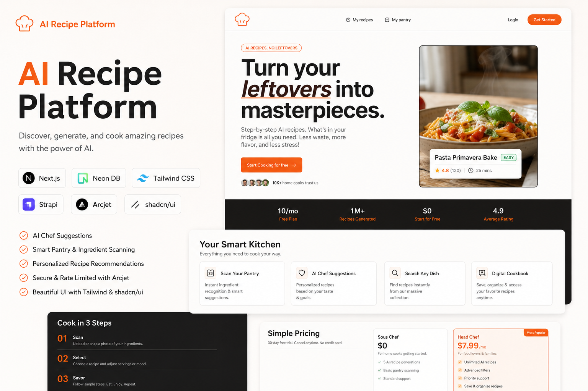

# 🍳 AI Recipe Platform

<p align="center">


</p>

<p align="center">
  
</p>

<p align="center">
  <strong>Turn your leftovers into masterpieces with AI.</strong>
</p>

<p align="center">
  Discover recipes, scan ingredients, and generate personalized meal suggestions using AI.
</p>

---

## 🚀 Live Demo

🔗 **Website:** https://servd-recipe-ai-platform.vercel.app/

---

## ✨ Features

- 🧠 AI-powered recipe generation
- 📷 Pantry and ingredient scanning
- 🍽 Personalized meal recommendations
- 🔎 Search recipes instantly
- 📚 Digital cookbook for saving recipes
- 📊 Nutritional analysis
- 🔒 Rate limiting and security with Arcjet
- 📱 Responsive and modern UI
- ⚡ Fast and optimized performance

---

## 🛠 Tech Stack

### Frontend
- Next.js
- Tailwind CSS
- shadcn/ui

### Backend
- Next.js Server Actions
- Strapi CMS

### Database
- Neon PostgreSQL

### Security
- Arcjet

### Authentication
- Clerk Authentication

### Deployment
- Vercel

---

## 🖼 Home Page

### Hero Section
Turn your leftovers into delicious meals with AI-generated recipe suggestions.

### Smart Kitchen Features
- Scan Your Pantry
- AI Chef Suggestions
- Search Any Dish
- Digital Cookbook

### Cook in 3 Steps

#### 1️⃣ Scan
Upload a photo of your ingredients and let AI identify them.

#### 2️⃣ Select
Choose from AI-generated recipes based on available ingredients.

#### 3️⃣ Savor
Follow simple instructions and enjoy delicious food.

---

## 📂 Project Structure

```bash
ai-recipe-platform
│
├── frontend
│   ├── actions
│   ├── app
│   ├── components
│   ├── hooks
│   ├── lib
│   └── public
│
├── backend
│   ├── config
│   ├── database
│   ├── public
│   ├── src
│   │   ├── admin
│   │   ├── api
│   │   ├── extensions
│   │   └── index.js
│   └── types
│
└── README.md
```

---

## ⚙️ Installation

### Clone the repository

```bash
git clone https://github.com/Shiva7784/ai-recipe-platform.git
```

### Navigate to the project

```bash
cd ai-recipe-platform
```

### Install dependencies

```bash
npm install
```

### Run the development server

```bash
npm run dev
```

Open:

```bash
http://localhost:3000
```

---

## 📦 Environment Variables

### Frontend (.env)

```env
DATABASE_URL=

NEXT_PUBLIC_CLERK_PUBLISHABLE_KEY=
CLERK_SECRET_KEY=

NEXT_PUBLIC_CLERK_SIGN_IN_URL=/sign-in
NEXT_PUBLIC_CLERK_SIGN_UP_URL=/sign-up

ARCJET_KEY=

NEXT_PUBLIC_STRAPI_URL=https://localhost:1337

STRAPI_API_TOKEN=

GEMINI_API_KEY=

UNSPLASH_ACCESS_KEY=
```

### Backend (.env)

```env

# Server
HOST=0.0.0.0
PORT=1337

# Secrets
APP_KEYS=
API_TOKEN_SALT=
ADMIN_JWT_SECRET=
TRANSFER_TOKEN_SALT=
ENCRYPTION_KEY=

# Database
DATABASE_CLIENT=
DATABASE_HOST=
DATABASE_PORT=
DATABASE_NAME=
DATABASE_USERNAME=
DATABASE_PASSWORD=
DATABASE_SSL=true
DATABASE_FILENAME=
JWT_SECRET=
```

---

## 🎯 Future Improvements

- Voice-based recipe assistant
- Shopping list generation
- Recipe sharing system
- AI nutritional tracking
- Favorites and bookmarks
- Multi-language support

---

## 📈 Performance

- Responsive Design
- SEO Optimized
- Server-side Rendering
- Fast Page Loading
- Secure API Requests

---

## 🤝 Contributing

Contributions are welcome!

1. Fork the repository
2. Create a new branch

```bash
git checkout -b feature-name
```

3. Commit changes

```bash
git commit -m "Added new feature"
```

4. Push changes

```bash
git push origin feature-name
```

5. Create a Pull Request

---

## ⭐ Support

If you found this project useful, consider giving the repository a ⭐ on GitHub.

---

## 👨‍💻 Author

**Shiva D S**

- GitHub: [Shiva7784](https://github.com/Shiva7784)
- LinkedIn: [shivads324](https://www.linkedin.com/in/shivads324)

---

## 📜 License

This project is licensed under the MIT License.

---

## 🌟 If you like this project

Give it a ⭐ on GitHub and feel free to contribute!

---

<p align="center">
Made with ❤️ by <strong>Shiva D S</strong>
</p>
